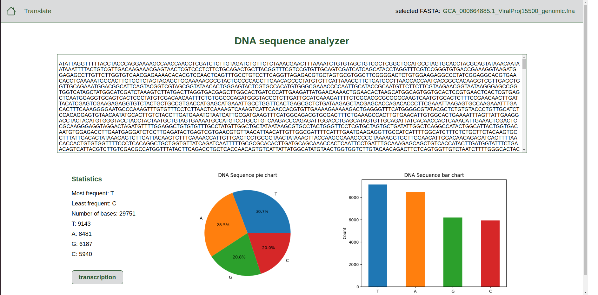

# Sequence Analyzer

A DNA sequence analyzer of FASTA file.

*Programming team project - University of Bologna (Bachelor Genomics, a.y. 2023-2024)*


<div style="display: flex; justify-content: center; flex-wrap: wrap;">
  
</div>
<div style="display: flex; justify-content: center; gap: 20px; flex-wrap: wrap;">
   
   
</div>


## Contributors

- Sofia Zanelli: [@SofZll](https://github.com/SofZll)
- Christian Guernelli: [@Jupiter929](https://github.com/Jupiter929)
- Giulia Mengoni: [@GiuliaMengoni](https://github.com/GiuliaMengoni)
- Nicolas Schiappa: [@NickSapphire](https://github.com/NickSapphire)

## Description

Web App that given a FASTA file is able to:
- parse the FASTA file and generates the trancription of a DNA sequence,
- show stats and frequency of nitrogenous bases,
- generates the DNA translations and show the obtained tRNA,
- allows amino acid chaining, and protein identification

## Input
The input consists of the complete genome sequence previously saved in the directory *"./fasta_file"*.
The alowed FASTA file extension are: *.fasta*, *.fna*, and *.fa*.

## Stack
<!-- Frontend -->
<p>
  
  
  
</p>

<!-- Backend -->
<p>
  
  
</p>

## to Run the Code
```bash
python3 Sequence_Analyzer.py
```
